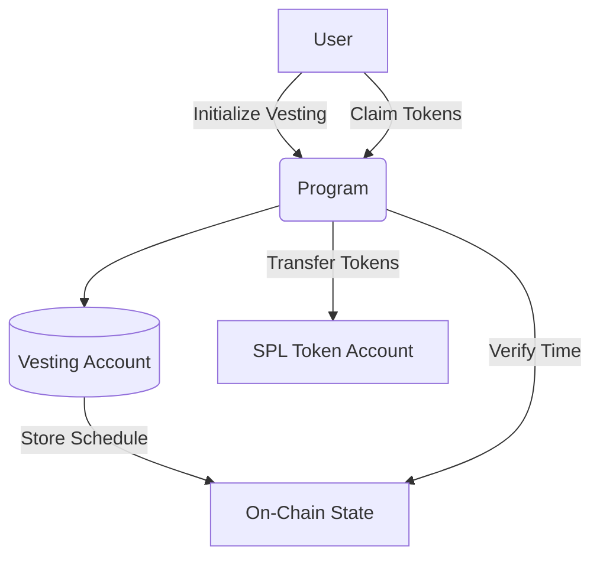

# 🔐 VestRust - Secure Token Vesting on Solana

[](https://www.anchor-lang.com/)
[](https://solana.com/)
[](https://opensource.org/licenses/MIT)

A **high-performance Rust program** for managing token vesting schedules on Solana. Perfect for teams, investors, and DAOs needing secure, on-chain token distribution.

## 🚀 Features

- **Linear vesting schedules** with configurable start/end times
- **Secure token locking** via Solana Program Library (SPL)
- **Anchor Framework** for type-safe Solana development
- **Time-based claims** with automatic unlocked amount calculation
- **Tamper-proof** - No admin keys can revoke vested tokens

## ⚙️ Technical Architecture



## 📦 Installation

### Prerequisites:
- **Rust** 1.65+
- **Solana CLI** 1.14+
- **Anchor** 0.28+

### Clone and Build:
```bash
git clone https://github.com/rgodlontonshaw/vestrust
cd vestrust
anchor build
```

### Deploy:
```bash
anchor deploy --provider.cluster devnet
```

## 💻 Usage

### Initialize Vesting Schedule
```typescript
const [vestingPDA] = await PublicKey.findProgramAddress(
  [
    recipient.toBuffer(),
    mint.toBuffer(),
    new BN(startTime).toArrayLike(Buffer, "le", 8),
  ],
  program.programId
);

await program.methods
  .initializeVesting(
    new BN(startTime),
    new BN(endTime),
    new BN(totalAmount)
  )
  .accounts({
    vestingAccount: vestingPDA,
    mint: mintAddress,
    recipient: recipientAddress,
    // ... other accounts
  })
  .rpc();
```

### Claim Vested Tokens
```typescript
const currentTime = new Date().getTime() / 1000;
const claimable = await program.methods
  .calculateClaimable()
  .accounts({ vestingAccount: vestingPDA })
  .view();

if (claimable > 0) {
  await program.methods
    .claimTokens()
    .accounts({
      vestingAccount: vestingPDA,
      tokenAccount: recipientTokenAccount,
      // ... other accounts
    })
    .rpc();
}
```

## 📚 Documentation
| Section          | Description                        |
|-----------------|--------------------------------|
| **API Reference** | Complete program instructions   |
| **Security Model** | Audit considerations           |
| **Gas Costs**      | Transaction fee analysis       |

## 🌟 Why Choose VestRust?

### ✅ Enterprise-Grade Security
```rust
#[derive(Accounts)]
pub struct InitializeVesting<'info> {
    #[account(init, payer = payer, space = 8 + VestingSchedule::LEN)]
    pub vesting_account: Account<'info, VestingSchedule>,
    // ... rigorous account validation
}
```

### ✅ Real-World Tested
- CI/CD with Anchor tests
- Mainnet-ready error handling
- Optimized for low gas costs

## 📈 Adoption Roadmap
- Core vesting logic ✅
- Multi-sig support ⏳
- NFT vesting extension ⏳
- Governance integration ⏳

## 🤝 Contributing
1. Fork the repository
2. Create your feature branch:
   ```bash
   git checkout -b feature/feature-name
   ```
3. Commit your changes:
   ```bash
   git commit -m 'Add feature'
   ```
4. Push to the branch:
   ```bash
   git push origin feature/your-feature
   ```
5. Open a Pull Request


